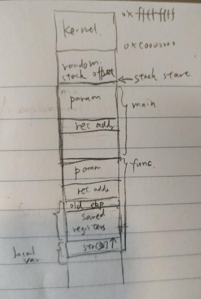

# Test Examples for Loop Summarization

### input-dependent
The 1st toy example used to test the basic function of loop summarization.
```bash
../../exec_utils/fuzzball -use-loopsum -trace-loop -trace-loopsum \
-fuzz-start-addr 0x8048561 -fuzz-end-addr 0x5006f63a -skip-call-ret-symbol 0x80485a6=n \
-solver smtlib -trace-iterations -trace-conditions \
-solver-path /path/to/z3/build/z3 -linux-syscalls \
-trace-stopping input-dependent -- ./input-dependent 0
```
### multi-occurence
Another basic example to test whether context-aware summarization works.

### ret-addr-overwrite
A running example that can demonstrate the benefit using loopsum in bug finding.



In this example, main() return address is overwritten, and FuzzBALL stops at symbolic execution.

With loopsum turned on, more total iterations (85 vs. 45) but earlier bug detecting (7 vs. 35).

To simplify this test, disable stack protector and pie by compiling this example with ``-fno-stack-protector`` and ``-no-pie``
```bash
gcc -m32 -no-pie -fno-stack-protector ret-addr-overwrite.c -g -o ret-addr-overwrite
```

Pure symbolic execution
```bash
../../exec_utils/fuzzball -use-loopsum -trace-loopsum \
-fuzz-start-addr 0x0804840d -symbolic-word 0x0804a01c=n \
-check-condition-at '0x08048456:mem[R_ESP:reg32_t]:reg32_t<>0x5003fe81:reg32_t' \
-finish-immediately -finish-on-nonfalse-cond \
-extra-condition 'n:reg32_t<=40:reg32_t' \
-trace-conditions -trace-iterations -solver smtlib \
-solver-path /path/to/z3/build/z3 -linux-syscalls -trace-stopping \
ret-addr-overwrite -- ./ret-addr-overwrite 0
```
To check return address overwrite, turn on both ``-check-for-ret-addr-overwrite`` and ``-finish-on-ret-addr-overwrite`` (currently doesn't work for this example.)

"2-path" experiment
```bash
# Create a file with value int 0x27
perl -e 'print "\x27\0\0\0"' > /tmp/input

# with -concolic-cstring-file, we can use 0x27 to direct concolic execution.
# You can add -tracepoint 0x8048405:'R_EAX:reg32_t' to check whether variable `c`
# is symbolic after applying loopsum
../../exec_utils/fuzzball -use-loopsum -trace-loopsum -fuzz-start-addr 0x0804840d \
-concolic-cstring-file 0x0804a01c=/tmp/input -concolic-prob 1.0 -num-paths 2 \
-trace-temps -trace-conditions -trace-iterations \
-solver smtlib -solver-path /path/to/z3/build/z3 -linux-syscalls \
-trace-stopping ret-addr-overwrite -- ./ret-addr-overwrite 0
```
